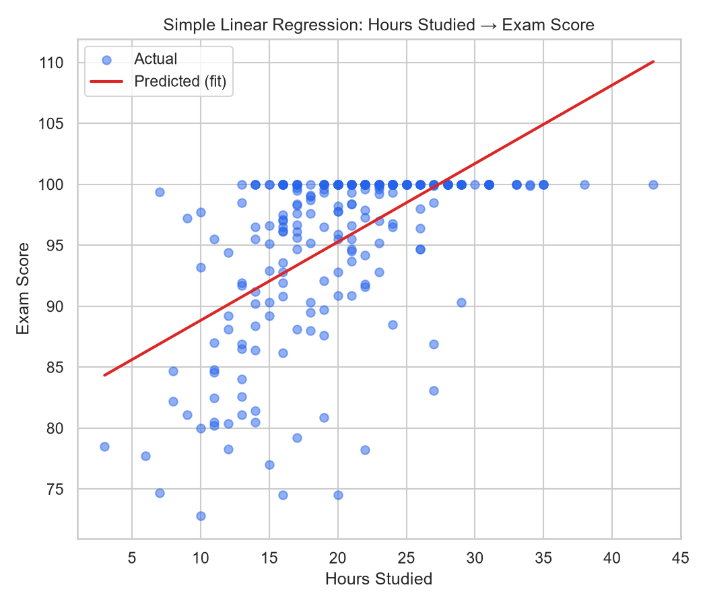

# Student Score Prediction

A linear regression project predicting students' exam scores from study habits and related factors, inspired by the Kaggle [Student Performance Factors](https://www.kaggle.com/datasets/lainguyn123/student-performance-factors) dataset.

## What this project does

- Cleans and prepares a student performance dataset (handles missing values and duplicates)
- Explores the data through visualizations (distributions, correlations)
- Splits data into training and testing sets
- Trains a linear regression model to predict exam scores from study hours
- Extends to a multiple regression model using all available features
- **Bonus:** Compares polynomial regression (degrees 1–3) against the linear baseline
- **Bonus:** Tests different feature combinations to see which factors matter most

## Results

| Model | R² | MAE | RMSE |
|---|---|---|---|
| Simple (Hours Studied only) | 0.30 | 4.33 | 5.59 |
| Multiple (all features) | 0.50 | 3.72 | 4.73 |

Adding attendance, previous scores, and tutoring sessions on top of study hours meaningfully improves prediction accuracy — study hours alone only explain about 30% of the variance in exam scores.

## Tools & Libraries

- Python
- Pandas
- Matplotlib / Seaborn
- Scikit-learn

## Project structure

```
├── generate_data.py      # builds the dataset
├── analysis.py            # cleaning, EDA, regression, evaluation, bonus experiments
├── StudentPerformanceFactors.csv        # raw dataset
├── StudentPerformanceFactors_clean.csv  # cleaned dataset
├── combo_results.csv      # feature combination experiment results
├── poly_results.csv       # polynomial regression experiment results
├── metrics_summary.txt    # summary of key model metrics
└── plots/                 # all generated charts
```

## How to run

```bash
pip install pandas numpy matplotlib seaborn scikit-learn
python generate_data.py
python analysis.py
```

Charts will be saved to the `plots/` folder, and metrics will print to the console.

## Sample output


